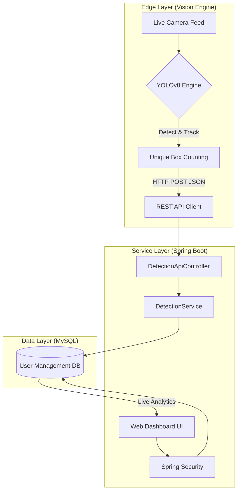

# 📦 Box Eye – Intelligent Cargo Monitoring System

Box Eye is an enterprise-grade smart logistics automation system designed to automate box counting during truck loading operations.  
It integrates **YOLOv8 (Deep Learning)** with a **Spring Boot backend** to ensure high accuracy, real-time visibility, and secure data management.

---

## 🏗 System Architecture
 


---

## 🔄 Technical Workflow

### 1. Detection Layer
- Captures live frames using OpenCV  
- YOLOv8 detects cargo boxes  
- Tracking algorithm assigns unique IDs  
- Prevents duplicate counting  

### 2. Transmission Layer
- Python sends JSON payload using HTTP POST  
- Data transmitted to Spring Boot REST API  

### 3. Persistence Layer
- Backend validates request  
- Stores detection event in MySQL using JPA & Hibernate  

### 4. Presentation Layer
- Thymeleaf UI fetches data from database  
- Chart.js displays real-time loading analytics  

---

## 🛠 Tech Stack

### AI / ML
- Python 3.9+
- Ultralytics YOLOv8
- OpenCV
- Requests

### Backend
- Java 17
- Spring Boot 3.x
- Spring Data JPA
- Hibernate

### Security
- Spring Security
- BCrypt Password Hashing

### Database
- MySQL 8.0

### Frontend
- Thymeleaf
- Bootstrap 5
- Chart.js

---

## 🚀 Installation & Setup

### 1️⃣ Database Setup

Run in MySQL:

```sql
CREATE DATABASE user_management_db;
```

Update credentials in:

```
User_Management_App/src/main/resources/application.properties
```

---

### 2️⃣ Backend Setup (Spring Boot)

Navigate to:

```
User_Management_App/
```

Run the application:

```bash
mvn spring-boot:run
```

Access dashboard:

```
http://localhost:8080
```

---

### 3️⃣ Vision Engine Setup (Python)

Navigate to:

```
VisionBoxz_ML/
```

Install dependencies:

```bash
pip install ultralytics opencv-python requests
```

Ensure trained model file:

```
best.pt
```

Start detection:

```bash
python main.py
```

---

## 📡 API Documentation

### Save Detection

```
POST /api/detections/save
```

### Sample Payload

```json
{
  "boxCount": 1,
  "status": "Loaded"
}
```

---

## 📁 Project Structure

```
├── User_Management_App/    # Spring Boot Web Application & Security
├── VisionBoxz_ML/          # YOLOv8 Inference Engine & Tracking Script
├── database_schema.sql     # Optional SQL schema
└── README.md
```

---

## ⚙️ Requirements

- Java 17+
- Python 3.9+
- MySQL 8.0
- Adjust `cv2.VideoCapture(index)` in `main.py` as per camera hardware

---

## ✨ Key Features

- Real-time box detection and tracking  
- Unique ID-based counting  
- Secure authentication system  
- Live analytics dashboard  
- REST-based communication architecture  

---

## 🔮 Future Enhancements

- Docker containerization  
- Cloud deployment (AWS / Azure)  
- Multi-camera support  
- Role-based access control  
- Alert notification system  

---
